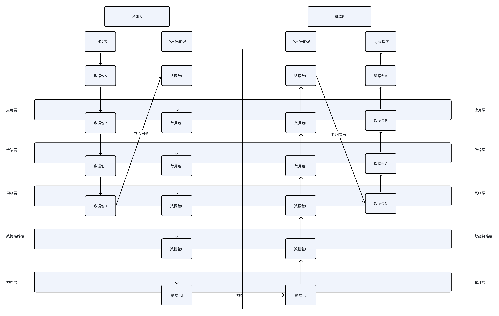

# IPv4ByIPv6
* 借助公网IPv6来实现内网IPv4组网
* 对项目[LocalIPv4UseIPv6](https://github.com/A0000000000/LocalIPv4UseIPv6)的重构
* 使用了TUN网卡来代理IP报文流量

# 相对之前项目的改进
* 移除全部三方依赖，全部使用go内置库实现
* 复用TCP6 Socket，避免重复建立链接
* TCP6 Socket加入心跳检查，自动清理已失效连接
* 移除配置文件，不再进行手动配置
* 引入Master和Node的概念，主要是为了实现一个中心化的配置中心，但是报文转发还是P2P的，Master提供了类似DHCP和DNS的功能

# 本程序原理
